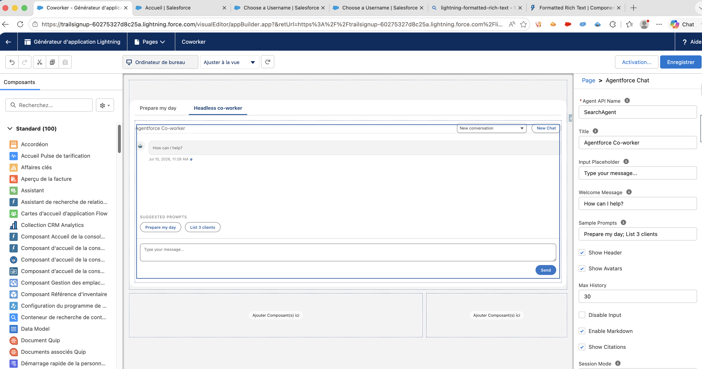

# Agentforce Chat LWC (Salesforce DX)

This project contains a reusable Lightning Web Component (`c-agentforce-chat`) and Apex facade (`AgentforceService`) for embedding an Agentforce chat experience anywhere in Lightning Experience.

## Introduction

Welcome to prompt engineering. In Agentforce experiences, outcome quality depends on two levers more than anything else: strong reusable skills and a well-crafted prompt. Skills package domain know-how and business rules into repeatable building blocks that can be user-specific or shared across teams, while a good prompt gives the agent clear intent, constraints, and expected output format. Together, they reduce ambiguity, improve consistency, and minimize hallucinations in production workflows.

**Example**

Instead of prompting:

> "Help me with this customer case."

Use a skill-aware, structured prompt:

> @manage-customer-complaints For `recordId` {CASE_ID}, act as a senior claims/customer-service specialist.  
> Classify the issue type and urgency, then produce:
>
> 1. Root cause hypothesis (with confidence % and missing data needed to confirm),
> 2. Top 3 next actions ranked by business impact and effort,
> 3. A French customer response email (empathetic, compliant, no legal admission, clear next step + ETA),
> 4. A short internal CRM note in English for the account owner,
> 5. Risk flags (regulatory, SLA breach, churn risk) with mitigation actions.  
>    Keep output concise with headings and bullets. If data is missing, state assumptions explicitly instead of inventing facts.

The second version performs better because it combines scoped expertise and business rules (`@skill`) with explicit instructions for context (`recordId`), deliverables, language, tone, compliance guardrails, and anti-hallucination behavior.

**TL;DR (why this repo exists):**

- This repo provides a practical Agentforce client pattern for Salesforce teams.
- It shows how to connect LWC UI, Apex orchestration, and metadata-driven skills into one reusable solution.
- The goal is to make high-quality, governed agent interactions easy to deploy, reuse, and evolve.
- Skills catalog: [Skills Index](./skills/index.md)
- Prompting guide: [Skills Prompting README](./skills/prompting-readme.md)

You can also quickly deploy the unmanaged app from this repository to get a working baseline and start customizing immediately (see [One-command deploy (recommended)](#one-command-deploy-recommended)).



The UI is decoupled from direct REST calls. The component calls Apex, and Apex invokes Agentforce through `Invocable.Action.createCustomAction(...)`.

## Implemented Features

- Reusable chat UI with conversation history and loading state.
- Dynamic agent selection UI backed by configured `BotDefinition` metadata.
- Suggested prompts, retry, copy assistant message, and auto-scroll.
- Session persistence for uncontrolled mode (`sessionStorage`).
- Public API methods: `sendMessage`, `clearConversation`, `focusInput`, `setSession`, `addSystemMessage`.
- Events: `message`, `response`, `error`, `sessionchange`, `voiceerror`.
- Markdown rendering with renderer choice and richer formatting support.
- Dedicated `c-voice-input` component for microphone capture with retry/error UX.
- Apex response normalization and user-safe error mapping.

## Supported Features

The current component implementation supports:

- **Agent invocation via Apex facade**
  - No direct LWC REST callouts to Agentforce.
  - Invokes Agentforce using `Invocable.Action.createCustomAction(...)`.
  - Exposes `getConfiguredAgents()` to drive the LWC agent picker from `BotDefinition`.
  - Exposes `getConfiguredAgentApiNames()` for lightweight validation/verification flows.

- **Agent selection UX**
  - `agentApiName` can be preconfigured or selected at runtime from available agents.
  - Optional collapsible picker section with agent details (label, description, freshness by `LastModifiedDate`).
  - Prevents message send until an agent is selected, with user-safe system guidance.
  - Persists selected agent and conversation/session history using the resolved selected agent key.

- **Conversation UX**
  - Send message with keyboard shortcut (`Enter`) and send button.
  - Loading/typing indicator while waiting for response.
  - Assistant message copy action.
  - Retry last failed message.
  - Auto-scroll behavior for active conversation flow.

- **History and session handling (browser-backed)**
  - Session persistence for uncontrolled mode.
  - Multiple browser-stored conversations per `agentApiName`.
  - New chat creation.
  - Conversation switcher (reopen previous messages).
  - Delete conversation history entry.

- **Prompt and context support**
  - `suggestions` array input.
  - `samplePrompts` string input (newline/semicolon/pipe parsing).
  - Record page context support via `recordId`.
  - `@skill` mentions resolved from custom metadata (`Coworker_Skill__mdt`) via `CoworkerSkillsController`.

- **Skills custom metadata integration**
  - Skills loaded from `Coworker_Skill__mdt` using `CoworkerSkillsController.getSkills()`.
  - Uses `MasterLabel` as mention label and `Content__c` as resolved prompt content.
  - Supports multi-word skill labels and `@` autocomplete in the composer.

- **Rendering**
  - Plain text mode using `lightning-formatted-text` with `linkify`.
  - Markdown mode with renderer strategy:
    - `richText`: `lightning-formatted-rich-text` compatibility renderer.
    - `custom`: dedicated `c-markdown-viewer`.
  - Custom markdown supports:
    - headings, bold/italic, inline/fenced code
    - ordered and unordered lists
    - blockquotes
    - horizontal rules (`---`, `***`, `___`)
    - tables (GFM-style pipe tables)
    - collapsible heading sections (enabled by default) with chevron indicators
  - Salesforce record-link rendering:
    - detects Lightning record URLs
    - shows record chip-style links
    - uses `NavigationMixin` (`standard__recordPage`) to keep navigation in-app/console-friendly
  - Citation list rendering when citations are present.

- **Voice input**
  - `agentforceChat` delegates microphone functionality to `c-voice-input`.
  - Browser-native speech recognition with:
    - secure-context and support checks
    - actionable error messages (permission, network, language, device)
    - automatic one-shot retry for transient network errors
    - manual "Try Again" action
  - Emits transcript updates to composer and forwards voice errors via `voiceerror`.

- **Public API and events**
  - Methods: `sendMessage`, `clearConversation`, `focusInput`, `setSession`, `addSystemMessage`.
  - Events: `message`, `response`, `error`, `sessionchange`.

- **Coworker skills discovery UX**
  - Category filter options are generated dynamically from loaded skill metadata.
  - Cards render in a responsive grid using container queries for better App Builder embedding.
  - Category card icon rendering is data-driven (`skill.icon`) and omitted when unavailable.

## Key Metadata

- LWC bundle: `force-app/main/default/lwc/agentforceChat`
- LWC bundle: `force-app/main/default/lwc/coworkerSkills`
- LWC bundle: `force-app/main/default/lwc/markdownViewer`
- LWC bundle: `force-app/main/default/lwc/voiceInput`
- Apex service: `force-app/main/default/classes/AgentforceService.cls`
- Skills controller: `force-app/main/default/classes/CoworkerSkillsController.cls`
- Skills metadata type: `Coworker_Skill__mdt`

## App Builder Configuration

Common `c-agentforce-chat` properties used in recent updates:

- `agentApiName` (optional preselection; can be chosen from configured agents at runtime)
- `markdownEnabled` (`true` to enable markdown rendering)
- `markdownRenderer` (`custom` or `richText`)
- `voiceInputEnabled` (`true` to show microphone capture)
- `voiceLanguage` (for example `en-US`, `fr-FR`)
- `minHeight` / `maxHeight` (CSS values like `auto`, `none`, `24rem`, `70vh`)
- `showHeader`, `showAvatar`, `maxHistory`, `showCitations`

## Skills via Custom Metadata (`@mentions`)

The chat supports skill mentions in user messages, for example:

- `@Analyse mon portefeuille client`

When a message is sent:

1. The component loads skills from Apex (`CoworkerSkillsController.getSkills`).
2. It matches `@label` in the user message against skill labels (`MasterLabel`).
3. It replaces each matched mention with the skill body (`Content__c`) before calling `AgentforceService`.

### Metadata requirements

Skills are read from custom metadata records of type `Coworker_Skill__mdt`.

Minimum required fields per record:

- `MasterLabel` (used as the `@label` mention text)
- `Content__c` (resolved text inserted into the prompt sent to the agent)

Optional fields (not required by resolution logic, but may be useful operationally):

- `Category__c`
- `Expected_Result__c`
- `Agents__c`
- `DeveloperName`

### UX behavior

- Type `@` in the composer to open skill autocomplete.
- Multi-word labels are supported.
- For user messages with resolved skills:
  - the `@mention` is visually emphasized in the chat bubble,
  - a bold `Resolved` status is shown in message meta,
  - hovering `Resolved` shows tooltip content,
  - clicking `Resolved` opens a modal with full resolved prompt text.

### Fallback behavior

If Apex skill loading is unavailable, the component can still parse optional `skillsJson` (if provided) using:

- `label`
- `content__c`

## Current Agentforce Invocation Shape

In `AgentforceService`, the invocable call uses:

```apex
Invocable.Action action = Invocable.Action.createCustomAction(
    ACTION_TYPE,
    null,
    agentApiName,
    '1.1.0'
);
```

Current constants:

- `ACTION_TYPE = 'generateAiAgentResponse'`
- `ACTION_NAME = 'generateAiAgentResponse'` (kept in class for compatibility/readability)

## Output Parsing Notes

Agentforce output in this org can arrive as:

- `response` (plain text), or
- `agentResponse` (JSON string), where text is at `value.message`.

`AgentforceService` handles both formats.

## Local Development

Install dependencies:

```bash
npm install
```

Lint LWC:

```bash
npx eslint "force-app/main/default/lwc/**/*.js"
```

Run Jest:

```bash
npm run test:unit
```

Run Apex test in org:

```bash
sf apex run test --target-org "<org-username-or-alias>" --tests "AgentforceServiceTest" --result-format json --code-coverage --wait 30
```

## Install Unmanaged Package

Install the unmanaged package directly in your org:

- [Install Agentforce Chat package](https://login.salesforce.com/?ec=302&startURL=%2Fpackaging%2FinstallPackage.apexp%3Fp0%3D04tKB000000cdy3%26InstHostname%3Dlogin.salesforce.com)
- [Install Agentforce Chat package (Sandbox)](https://test.salesforce.com/?ec=302&startURL=%2Fpackaging%2FinstallPackage.apexp%3Fp0%3D04tKB000000cdy3%26InstHostname%3Dtest.salesforce.com)

After opening the link:

1. Sign in with the org where you want to install the package.
2. Review and accept the package access/security prompts.
3. Choose install scope (recommended: **Install for Admins Only** first).
4. Complete installation and wait for confirmation.

### Use after install

1. Open **Lightning App Builder** in the target org.
2. Add **Agentforce Chat** (`c-agentforce-chat`) to the page.
3. Set `agentApiName` to your Agentforce agent API name.
4. Optionally configure prompts, markdown, voice input, and history settings.

## Deploy

Use this sequence for predictable deployments.

### 1) Authenticate and select target org

```bash
sf org login web --alias "<org-alias>"
sf org display --target-org "<org-alias>"
```

### 2) (Recommended) Validate before deploy

```bash
sf project deploy start \
  --dry-run \
  --target-org "<org-alias>" \
  --source-dir "force-app/main/default/classes/AgentforceService.cls" \
  --source-dir "force-app/main/default/classes/AgentforceService.cls-meta.xml" \
  --source-dir "force-app/main/default/classes/CoworkerSkillsController.cls" \
  --source-dir "force-app/main/default/classes/CoworkerSkillsController.cls-meta.xml" \
  --source-dir "force-app/main/default/objects/Coworker_Skill__mdt" \
  --source-dir "force-app/main/default/layouts/Coworker_Skill__mdt-Coworker Skill Layout.layout-meta.xml" \
  --source-dir "force-app/main/default/classes/AgentforceServiceTest.cls" \
  --source-dir "force-app/main/default/classes/AgentforceServiceTest.cls-meta.xml" \
  --source-dir "force-app/main/default/lwc/agentforceChat" \
  --source-dir "force-app/main/default/lwc/markdownViewer" \
  --source-dir "force-app/main/default/lwc/voiceInput" \
  --wait 30 \
  --json
```

### 3) Deploy Apex service + tests

```bash
sf project deploy start \
  --target-org "<org-alias>" \
  --source-dir "force-app/main/default/classes/AgentforceService.cls" \
  --source-dir "force-app/main/default/classes/AgentforceService.cls-meta.xml" \
  --source-dir "force-app/main/default/classes/AgentforceServiceTest.cls" \
  --source-dir "force-app/main/default/classes/AgentforceServiceTest.cls-meta.xml" \
  --wait 30 \
  --json
```

### 4) Deploy LWC bundles

```bash
sf project deploy start \
  --target-org "<org-alias>" \
  --source-dir "force-app/main/default/lwc/agentforceChat" \
  --source-dir "force-app/main/default/lwc/markdownViewer" \
  --source-dir "force-app/main/default/lwc/voiceInput" \
  --wait 30 \
  --json
```

### 5) Run Apex test

```bash
sf apex run test \
  --target-org "<org-alias>" \
  --tests "AgentforceServiceTest" \
  --result-format json \
  --code-coverage \
  --wait 30
```

### 6) Add component to a Lightning page

1. Open the org: `sf org open --target-org "<org-alias>"`
2. Go to **Lightning App Builder**.
3. Add **Agentforce Chat** (`c-agentforce-chat`) to a page.
4. Configure at minimum:
   - `agentApiName` (for example `CRM_Assistant`)
   - optional `samplePrompts`
   - optional `skillsJson` (only as fallback / small local config)
   - optional `showHeader`, `showAvatar`, `maxHistory`

### One-command deploy (recommended)

This project includes a manifest that contains all required metadata for the chat component:

- `manifest/package-agentforce-chat.xml`

Deploy everything with one command:

```bash
sf project deploy start \
  --target-org "<org-alias>" \
  --manifest "manifest/package-agentforce-chat.xml" \
  --wait 30 \
  --json
```

Optional dry-run validation:

```bash
sf project deploy start \
  --dry-run \
  --target-org "<org-alias>" \
  --manifest "manifest/package-agentforce-chat.xml" \
  --wait 30 \
  --json
```

## Anonymous Verification Scripts

These helper scripts are included under `scripts/`:

- `verifyAgentforceService.apex`
- `verifyAgentforceInvoker.apex`
- `verifyGetConfiguredAgentApiNames.apex`
- `inspectInvocableResult.apex`

Example:

```bash
sf apex run --target-org "<org-username-or-alias>" --file "scripts/verifyAgentforceService.apex" --json
```

## Salesforce Classic Support (Visualforce Host)

The repo includes a Lightning Out bridge to render the chat component in Salesforce Classic:

- Aura host component: `force-app/main/default/aura/AgentforceChatHost`
- Lightning Out app: `force-app/main/default/aura/AgentforceClassicOutApp`
- Visualforce page: `force-app/main/default/pages/AgentforceClassic.page`

Open the page in Classic with a record id:

```text
/apex/AgentforceClassic?id=<RECORD_ID>
```

Example:

```text
/apex/AgentforceClassic?id=001XXXXXXXXXXXXXXX
```

## Contributing

Contributions are very welcome. If you want to improve the component, please open a pull request with:

- a short description of the problem and approach,
- tests for behavior changes (Jest and/or Apex as applicable),
- and deployment notes when metadata shape changes.

Suggested workflow:

1. Create a feature branch.
2. Implement changes in small, reviewable commits.
3. Run lint and tests locally.
4. Open a PR with screenshots or short notes for UI changes.

If you have ideas but not a full implementation, opening an issue with repro steps is also appreciated.

## License

This project is licensed under the MIT License. See `LICENSE` for details.
